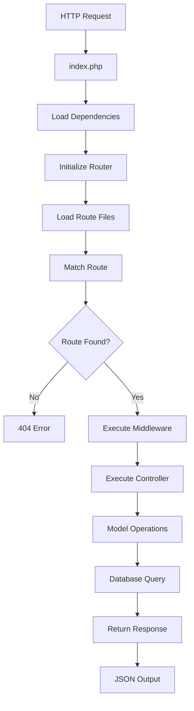

# Complete API Structure Guide & Developer Handbook

## 📁 Directory Structure Overview

```
api/
├── 📄 index.php                    # Application Entry Point
├── 📄 .env                         # Environment Configuration
├── 📄 .htaccess                    # URL Rewriting Rules
├── 📁 config/                      # Configuration Files
│   ├── 📄 database.php             # Database Connection Setup
│   └── 📄 jwt.php                  # JWT Token Management
├── 📁 core/                        # Core Framework Components
│   └── 📄 Router.php               # Custom Routing System
├── 📁 middleware/                  # HTTP Middleware Components
│   └── 📄 AuthMiddleware.php       # Authentication Guard
├── 📁 routes/                      # Route Definitions
│   ├── 📄 api.php                  # Main Route Registry
│   ├── 📄 auth.php                 # Authentication Routes
│   └── 📄 users.php                # User Management Routes
├── 📁 controllers/                 # Request Handlers
│   ├── 📄 AuthController.php       # Authentication Logic
│   └── 📄 UserController.php       # User Management Logic
├── 📁 models/                      # Data Access Layer
│   └── 📄 User.php                 # User Data Model
├── 📁 utils/                       # Utility Classes
│   ├── 📄 Response.php             # API Response Handler
│   └── 📄 Validator.php            # Input Validation
└── 📁 logs/                        # Application Logs (create manually)
    └── 📄 app.log                  # Log File
```

---

## 🔄 Application Flow & Architecture

### **1. Request Lifecycle**



### **2. Detailed Flow Explanation**

1. **Entry Point** (`index.php`)
   - All requests hit this file first
   - Sets up CORS headers
   - Handles OPTIONS requests
   - Loads all necessary dependencies
   - Initializes the Router

2. **Route Resolution** (`core/Router.php`)
   - Parses the incoming URL
   - Matches against registered routes
   - Extracts URL parameters
   - Determines which controller/method to call

3. **Middleware Execution** (`middleware/`)
   - Runs before controller execution
   - Handles authentication, logging, rate limiting
   - Can block request if conditions aren't met

4. **Controller Processing** (`controllers/`)
   - Handles business logic
   - Validates input data
   - Calls appropriate model methods
   - Returns formatted responses

5. **Model Operations** (`models/`)
   - Handles database interactions
   - Data validation and sanitization
   - Business rules enforcement

6. **Response Generation** (`utils/Response.php`)
   - Standardizes API responses
   - Sets appropriate HTTP status codes
   - Returns JSON formatted data

---

## 📂 Detailed Directory Breakdown

### **📄 index.php - Application Bootstrap**

**Purpose:** Single entry point for all API requests

**Key Responsibilities:**
- Set CORS headers for cross-origin requests
- Handle preflight OPTIONS requests
- Load all required dependencies
- Initialize and configure the router
- Handle global exception catching
- Start session management

**Why Important:**
- Provides centralized request handling
- Ensures consistent setup for every request
- Makes debugging easier with single entry point
- Enables global middleware and error handling

### **📁 config/ - Configuration Management**

#### **database.php**
**Purpose:** Database connection and configuration

**Key Features:**
- PDO connection with prepared statements
- Connection pooling and reuse
- Error handling for database failures
- Charset and security configurations

**Best Practices:**
- Use environment variables for credentials
- Enable PDO error exceptions
- Set proper charset (utf8mb4)
- Use connection singleton pattern

#### **jwt.php**
**Purpose:** JSON Web Token management

**Key Features:**
- Token encoding and decoding
- Signature verification
- Expiration handling
- Custom payload support

**Security Considerations:**
- Use strong secret keys (256+ chars)
- Implement token expiration
- Validate token signatures
- Handle token refresh logic

### **📁 core/ - Framework Components**

#### **Router.php**
**Purpose:** Custom routing system for clean URL handling

**Key Features:**
- HTTP method routing (GET, POST, PUT, DELETE)
- URL parameter extraction (`/users/{id}`)
- Route grouping with prefixes
- Middleware support per route/group
- Pattern matching for dynamic routes

**Advanced Capabilities:**
```php
// Parameter extraction
/users/{id} → matches /users/123 → passes 123 to controller

// Route grouping
/api/v1/users/{id} → organized route structure

// Middleware chaining
['AuthMiddleware', 'AdminMiddleware'] → multiple guards
```

### **📁 middleware/ - HTTP Middleware**

#### **AuthMiddleware.php**
**Purpose:** Authentication guard for protected routes

**Functionality:**
- JWT token validation
- Bearer token extraction from headers
- User context establishment
- Unauthorized request blocking

**Flow:**
1. Extract Authorization header
2. Validate Bearer token format
3. Decode and verify JWT
4. Set current user context
5. Allow/deny request continuation

### **📁 routes/ - Route Definitions**

#### **api.php - Route Registry**
**Purpose:** Central route organization and grouping

**Structure:**
```php
// Group authentication routes (no middleware)
$router->group('/auth', function($router) {
    require_once 'routes/auth.php';
});

// Group protected routes (with authentication)
$router->group('', function($router) {
    require_once 'routes/users.php';
}, ['AuthMiddleware']);
```

#### **auth.php - Authentication Routes**
**Purpose:** User authentication endpoints

**Available Routes:**
- `POST /auth/login` - User login
- `POST /auth/register` - User registration
- `POST /auth/refresh` - Token refresh
- `POST /auth/logout` - User logout

#### **users.php - User Management Routes**
**Purpose:** CRUD operations for user management

**Available Routes:**
- `GET /users` - List all users
- `POST /users` - Create new user
- `GET /users/{id}` - Get specific user
- `PUT /users/{id}` - Update user
- `DELETE /users/{id}` - Delete user
- `GET /users/profile` - Current user profile
- `PUT /users/profile` - Update current user profile

### **📁 controllers/ - Request Handlers**

#### **AuthController.php**
**Purpose:** Authentication business logic

**Methods:**
- `register()` - Handle user registration
- `login()` - Handle user authentication
- `refresh()` - Generate new JWT tokens

**Responsibilities:**
- Input validation
- Password hashing/verification
- JWT token generation
- Error response handling

#### **UserController.php**
**Purpose:** User management operations

**Methods:**
- `getAllUsers()` - Paginated user listing
- `getUserById($id)` - Single user retrieval
- `createUser()` - New user creation
- `updateUser($id)` - User modification
- `deleteUser($id)` - User removal
- `getCurrentUserProfile()` - Authenticated user profile
- `updateCurrentUserProfile()` - Profile updates

### **📁 models/ - Data Access Layer**

#### **User.php**
**Purpose:** User data management and database operations

**Key Methods:**
- `create($data)` - Insert new user
- `findByEmail($email)` - Email-based lookup
- `findById($id)` - ID-based retrieval
- `getAll($limit, $offset)` - Paginated listing
- `update($id, $data)` - User modification
- `delete($id)` - User removal
- `verifyPassword($password, $hash)` - Password verification

**Features:**
- Prepared statements for security
- Password hashing with bcrypt
- Input sanitization
- Error handling

### **📁 utils/ - Utility Classes**

#### **Response.php**
**Purpose:** Standardized API response formatting

**Methods:**
- `success($data, $message, $code)` - Success responses
- `error($message, $code, $errors)` - Error responses

**Response Format:**
```json
{
    "success": true,
    "message": "Operation successful",
    "data": {...},
    "timestamp": "2025-01-15 10:30:00"
}
```

#### **Validator.php**
**Purpose:** Input validation and sanitization

**Methods:**
- `validateEmail($email)` - Email format validation
- `validateRequired($fields, $data)` - Required field checking
- `validateMinLength($value, $minLength)` - Length validation

---

## 🚀 Development Workflow

### **Adding New Features**

#### **1. Create New Route File**
```php
// routes/posts.php
$router->get('/posts', 'PostController@index');
$router->post('/posts', 'PostController@store');
$router->get('/posts/{id}', 'PostController@show');
$router->put('/posts/{id}', 'PostController@update');
$router->delete('/posts/{id}', 'PostController@destroy');
```

#### **2. Register Routes**
```php
// routes/api.php
$router->group('/posts', function($router) {
    require_once 'routes/posts.php';
}, ['AuthMiddleware']);
```

#### **3. Create Controller**
```php
// controllers/PostController.php
class PostController {
    private $postModel;
    
    public function __construct() {
        $this->postModel = new Post();
    }
    
    public function index() {
        $posts = $this->postModel->getAll();
        Response::success($posts, 'Posts retrieved successfully');
    }
    
    public function show($id) {
        $post = $this->postModel->findById($id);
        if (!$post) {
            Response::error('Post not found', 404);
        }
        Response::success($post, 'Post retrieved successfully');
    }
}
```

#### **4. Create Model**
```php
// models/Post.php
class Post {
    private $db;
    
    public function __construct() {
        $database = new Database();
        $this->db = $database->connect();
    }
    
    public function getAll() {
        $sql = "SELECT * FROM posts ORDER BY created_at DESC";
        $stmt = $this->db->prepare($sql);
        $stmt->execute();
        return $stmt->fetchAll();
    }
}
```

---

## 👥 Team Development Guidelines

### **Code Organization Standards**

#### **1. Naming Conventions**
- **Classes:** PascalCase (`UserController`, `AuthMiddleware`)
- **Methods:** camelCase (`getUserById`, `validateEmail`)
- **Files:** PascalCase for classes, lowercase for others
- **Routes:** kebab-case (`/users/profile`, `/auth/login`)

#### **2. File Structure Rules**
- One class per file
- Filename matches class name
- Use descriptive method names
- Group related functionality

#### **3. Error Handling**
```php
// Always use try-catch blocks
try {
    $result = $this->model->operation();
    Response::success($result, 'Success message');
} catch (Exception $e) {
    Response::error('Operation failed: ' . $e->getMessage(), 500);
}
```

### **Security Best Practices**

#### **1. Input Validation**
```php
// Always validate input
$errors = Validator::validateRequired(['name', 'email'], $input);
if (!empty($errors)) {
    Response::error('Validation failed', 400, $errors);
}
```

#### **2. SQL Security**
```php
// Use prepared statements
$sql = "SELECT * FROM users WHERE email = ?";
$stmt = $this->db->prepare($sql);
$stmt->execute([$email]);
```

#### **3. Authentication**
```php
// Check authentication in protected routes
$currentUser = getCurrentUser();
if (!$currentUser) {
    Response::error('Authentication required', 401);
}
```

### **Database Operations**

#### **1. Model Structure**
```php
class ExampleModel {
    private $db;
    
    public function __construct() {
        $database = new Database();
        $this->db = $database->connect();
    }
    
    public function create($data) {
        $sql = "INSERT INTO table_name (column1, column2) VALUES (?, ?)";
        $stmt = $this->db->prepare($sql);
        return $stmt->execute([$data['field1'], $data['field2']]);
    }
}
```

#### **2. Query Patterns**
- Use prepared statements for all queries
- Implement proper error handling
- Return meaningful data structures
- Handle edge cases (no results, duplicates)

---

## 🛠️ Environment Setup

### **Development Environment**

#### **1. Requirements**
- PHP 7.4+ (8.0+ recommended)
- MySQL 5.7+ or MariaDB 10.3+
- Web server (Apache/Nginx)
- Composer (for dependency management)

#### **2. Installation Steps**
```bash
# 1. Clone repository
git clone <repository-url>

# 2. Install dependencies (if using Composer)
composer install

# 3. Copy environment file
cp .env.example .env

# 4. Configure database
# Edit .env file with your database credentials

# 5. Create database tables
# Run SQL schema from the provided file

# 6. Set permissions
chmod 755 logs/
chmod 644 .env
```

#### **3. Apache Configuration**
```apache
# .htaccess
RewriteEngine On
RewriteCond %{REQUEST_FILENAME} !-f
RewriteCond %{REQUEST_FILENAME} !-d
RewriteRule ^(.*)$ index.php [QSA,L]
```

### **Production Deployment**

#### **1. Security Checklist**
- [ ] Change JWT secret to strong random string
- [ ] Set `APP_DEBUG=false` in production
- [ ] Enable HTTPS only
- [ ] Restrict database user permissions
- [ ] Set proper file permissions (644 for files, 755 for directories)
- [ ] Hide .env file from web access

#### **2. Performance Optimization**
- Enable OPcache for PHP
- Use database connection pooling
- Implement response caching
- Add rate limiting middleware
- Optimize database queries with indexes

---

## 🧪 Testing Strategy

### **1. API Testing**
```bash
# Test authentication
curl -X POST http://localhost/api/auth/login \
  -H "Content-Type: application/json" \
  -d '{"email":"test@example.com","password":"password"}'

# Test protected endpoint
curl -X GET http://localhost/api/users \
  -H "Authorization: Bearer YOUR_JWT_TOKEN"
```

### **2. Unit Testing Structure**
```php
// tests/UserControllerTest.php
class UserControllerTest {
    public function testGetUserById() {
        // Test user retrieval
    }
    
    public function testCreateUser() {
        // Test user creation
    }
}
```

---

## 📈 Scaling Considerations

### **1. Database Optimization**
- Add proper indexes on frequently queried columns
- Implement database query caching
- Consider read replicas for heavy read operations
- Use connection pooling

### **2. API Enhancements**
- Add rate limiting middleware
- Implement response caching
- Add API versioning (`/v1/`, `/v2/`)
- Implement pagination for large datasets

### **3. Monitoring & Logging**
- Add request/response logging
- Implement error tracking (Sentry)
- Monitor API performance metrics
- Set up health check endpoints

---

## 🔧 Common Development Tasks

### **Adding New Middleware**
```php
// middleware/RateLimitMiddleware.php
class RateLimitMiddleware {
    public function handle() {
        // Implement rate limiting logic
        $clientIP = $_SERVER['REMOTE_ADDR'];
        // Check rate limit for this IP
        // Block if exceeded
    }
}

// Apply to routes
$router->group('/api', function($router) {
    // Routes here
}, ['RateLimitMiddleware']);
```

### **API Versioning**
```php
// routes/api.php
$router->group('/v1', function($router) {
    require_once 'routes/v1/users.php';
    require_once 'routes/v1/auth.php';
});

$router->group('/v2', function($router) {
    require_once 'routes/v2/users.php';
    require_once 'routes/v2/auth.php';
});
```

### **Custom Validation Rules**
```php
// utils/Validator.php
public static function validatePhoneNumber($phone) {
    return preg_match('/^\+?[1-9]\d{1,14}$/', $phone);
}

public static function validateAge($age) {
    return is_numeric($age) && $age >= 18 && $age <= 120;
}
```

---

## 📋 Developer Onboarding Checklist

### **New Team Member Setup**

#### **1. Environment Setup**
- [ ] Install PHP, MySQL, and web server
- [ ] Clone repository and set up local environment
- [ ] Configure database connection
- [ ] Test API endpoints with provided examples

#### **2. Code Understanding**
- [ ] Review directory structure and purpose
- [ ] Understand request flow and lifecycle
- [ ] Study existing controllers and models
- [ ] Practice adding a simple feature (e.g., new endpoint)

#### **3. Development Standards**
- [ ] Review coding standards and conventions
- [ ] Understand security best practices
- [ ] Learn testing procedures
- [ ] Set up development tools (debugger, linter)

#### **4. Documentation Review**
- [ ] API endpoint documentation
- [ ] Database schema understanding
- [ ] Authentication flow comprehension
- [ ] Error handling patterns

---

## 🚨 Troubleshooting Guide

### **Common Issues**

#### **1. Route Not Found (404)**
- Check route definition in appropriate route file
- Verify route is registered in `routes/api.php`
- Ensure controller and method exist
- Check URL rewriting is working

#### **2. Authentication Failed (401)**
- Verify JWT token is being sent in headers
- Check token format: `Authorization: Bearer TOKEN`
- Ensure JWT secret matches between encoding/decoding
- Verify token hasn't expired

#### **3. Database Connection Failed**
- Check database credentials in `.env`
- Verify database server is running
- Ensure database exists and user has permissions
- Test connection with PDO directly

#### **4. Internal Server Error (500)**
- Check PHP error logs
- Enable debug mode in development
- Verify all required files are included
- Check for syntax errors in code

---

This structure provides a solid foundation for building scalable, maintainable APIs with clean separation of concerns and professional development practices.